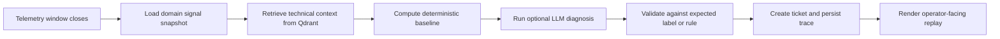

# Physical Systems Intelligence

Reusable AI diagnostics for physical assets: telemetry, technical documents, expected-label validation, and operational action.

This project packages a concrete operating pattern for physical systems:
capture a real signal window, ground the decision in technical documentation,
run an auditable diagnostic flow, validate against known truth when available,
and produce an operational action.

The current public demo replays a realistic maintenance gate on NASA C-MAPSS
FD001 data, but the same runtime shape is meant to carry over to machines,
electrical systems, infrastructure, robotics, and other instrumented assets by
swapping domain packs.



## Demo At A Glance

- real benchmark-backed telemetry snapshot
- repo-pinned long-form NASA source corpus for RAG
- LangGraph workflow orchestration
- Qdrant retrieval with visible provenance
- Postgres-backed tickets and run trace
- React replay surface and GitHub Pages build

Current NASA demo corpus is repo-pinned under
`backend/app/domains/nasa_cmapss_turbofan/documents/` as long-form Markdown
adaptations grounded in official NASA DASHlink and NASA NTRS material. RAG
evidence now carries canonical provenance metadata such as source label, source
URL, related source URLs, source authority, source type, and section title so
the replay can show exactly where each retrieved statement came from.

## Get Started

```bash
git clone <your-repo-url>
cd physical-systems-intelligence
cp .env.example .env
docker compose up --build
```

Open:

- Frontend: `http://localhost:5173`
- Backend health: `http://localhost:8122/health`
- FastAPI docs: `http://localhost:8122/docs`
- Qdrant: `http://localhost:6333/dashboard`

## Run The Real Demo

The primary demo is an autonomous health-gate replay for NASA C-MAPSS FD001
turbofan unit 1. In a real deployment, this workflow would run when an asset
closes a telemetry window. In the demo, `Run SignalTrace` manually recreates the
same event:

- trigger: cycle `31` telemetry window closed,
- physical condition: known high-pressure-compressor degradation context,
- system task: retrieve domain documents, inspect the signal window, validate the
  expected RUL label, and create a maintenance review ticket.

The demo uses real benchmark data:

- observed cycles: `31`
- published ground-truth RUL: `112`
- expected failure cycle: `143`
- source: NASA C-MAPSS `RUL_FD001` first row

The demo also uses repo-pinned NASA reference documents rather than tiny local
notes. Those documents are chunked by section and then split into overlap
windows for long sections, so retrieval stays auditable while still covering
long-form source text.

Ingest the NASA technical documents:

```bash
curl -X POST http://localhost:8122/documents/ingest \
  -H "Content-Type: application/json" \
  -d "{\"domain_id\":\"nasa_cmapss_turbofan\"}"
```

Run the current diagnostic endpoint:

```bash
curl -X POST http://localhost:8122/agent/diagnose \
  -H "Content-Type: application/json" \
  -d "{\"domain_id\":\"nasa_cmapss_turbofan\",\"system_id\":\"FD001-UNIT-001\",\"question\":\"What is the engine health status and what should maintenance do?\"}"
```

Run the SignalTrace workflow endpoint:

```bash
curl -X POST http://localhost:8122/workflows/diagnose \
  -H "Content-Type: application/json" \
  -d "{\"domain_id\":\"nasa_cmapss_turbofan\",\"system_id\":\"FD001-UNIT-001\",\"question\":\"What is the engine health status and what should maintenance do?\",\"create_ticket\":true}"
```

## What SignalTrace Does

SignalTrace Runtime is the public-facing workflow layer. The button in the demo
does not stand for an operator typing a random question; it stands for a manual
replay of the autonomous trigger that would normally be started by a scheduler,
stream processor, PLC bridge, fleet system, or asset event bus.

```text
load_signals -> retrieve_docs -> compute_baseline -> ai_diagnose -> validate_expected -> create_ticket
```

The goal is not a one-off asset demo. The reusable core should support machines, electrical systems, infrastructure, robotics, lab instruments, and test rigs by swapping domain packs.

Each domain pack can change:

- technical documents,
- signal schemas and snapshots,
- diagnostic prompts and policies,
- expected labels or acceptance checks,
- action/ticket configuration.

## AI Pipeline

Current backend behavior:

- reads signal snapshots,
- chunks and indexes repo-pinned Markdown documents from NASA/NTRS/DASHlink
  source adaptations,
- searches Qdrant or in-memory vectors,
- builds deterministic baseline diagnosis,
- optionally calls OpenAI Responses API with `gpt-5.4-nano`,
- returns evidence, recommended actions, and token usage when AI is enabled.

Qdrant is used for document grounding, not telemetry storage. The telemetry
window stays in the domain signal snapshot; Qdrant stores embedded document
chunks such as RUL semantics, sensor watchlists, and health-gate policy. The
workflow retrieves those chunks and passes them into the diagnosis path.

Current workflow upgrade:

- real local embeddings by default in Docker,
- auditable retrieval metadata with canonical provenance fields surfaced in the
  evidence panel,
- persisted run trace,
- expected-label evals,
- visible frontend workflow.

Source inventory for current NASA corpus:

- [docs/rag-sources.md](docs/rag-sources.md)

## Real Benchmark Case

`nasa_cmapss_turbofan` uses NASA's C-MAPSS Turbofan Engine Degradation Simulation Data Set.

Functional target:

- dataset: `FD001`
- test unit: `1`
- last observed cycle: `31`
- published ground-truth RUL: `112`
- expected failure cycle: `143`

This verifies retrieval, evidence, structured diagnosis, and expected-label grounding. It does not claim to train a prognostic model.

## Architecture

```text
frontend/          React + Vite static/live console
backend/           FastAPI API
postgres           action tickets and workflow traces
qdrant             document chunks and retrieval vectors
domains/           swappable physical-system packs
```

Current endpoints:

```text
GET  /health
GET  /domains
GET  /systems
GET  /systems/{system_id}/signals
POST /documents/ingest
POST /agent/diagnose
POST /actions/tickets
```

Workflow endpoints:

```text
POST /workflows/diagnose
GET  /workflows/runs
GET  /workflows/runs/{run_id}
POST /evals/nasa-cmapss/fd001-unit-001
```

## Testing Matrix

Backend:

```bash
cd backend
python -m pytest tests -q
python -m ruff check app tests
```

Frontend:

```bash
cd frontend
npm run build
npm run test:e2e
```

Docker:

```bash
docker compose config
docker compose up --build
```

Live OpenAI e2e is gated by env vars and must prove non-zero token usage before any AI-complete claim.

## Local Development

Backend:

```bash
cd backend
python -m venv .venv
.venv\Scripts\activate
pip install -e ".[dev]"
pytest
uvicorn app.main:app --reload
```

Frontend:

```bash
cd frontend
npm install
npm run dev
npm run build
npm run test:e2e
```

## GitHub Pages

The GitHub Pages site is a static replay of the same product surface. The target visual language is light, centered, compact, and technical.

Workflow: `.github/workflows/pages.yml`

Build output: `frontend/dist`

## Production Gaps

This is a compact MVP, not an enterprise platform. Production work would add:

- auth and access control,
- live PLC, SCADA, MES, ERP, or fleet adapters,
- streaming telemetry ingestion,
- action approval workflows,
- trained prognostic models where needed,
- audit log retention,
- deployment hardening.
