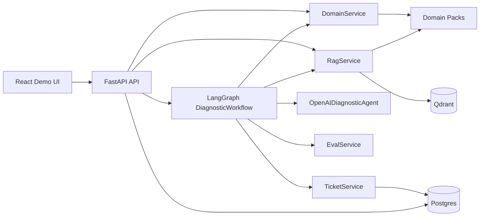
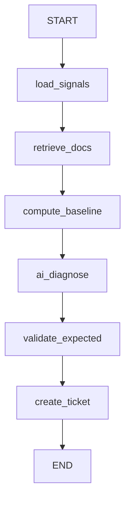

# Architecture

## Purpose

Physical Systems Intelligence is a compact runtime for one concrete job:

1. read a physical-system telemetry snapshot,
2. retrieve the relevant operating documents,
3. produce a diagnostic decision,
4. validate that decision against a known label or rule when available,
5. persist the action trace.

The current repo is intentionally narrow. It is not a generic agent platform yet.
It is a real diagnostic workflow with RAG, a single LLM step, validation, and ticketing.
Current NASA pack uses repo-pinned long-form Markdown adaptations of official
NASA material instead of short handwritten notes, so retrieval behavior and
evidence provenance are part of repo truth.

## Serious Assessment

What is real now:

- FastAPI backend, React frontend, Postgres, Qdrant, Docker Compose.
- Real LangGraph orchestration for the workflow endpoint.
- Real document ingestion and retrieval through `RagService`.
- Real OpenAI call path through `OpenAIDiagnosticAgent` when enabled.
- Real persisted run trace and ticket creation.
- Real benchmark-backed demo case with NASA FD001 unit 1.

What is intentionally not there yet:

- no multi-agent planning loop,
- no branching policy graph beyond a linear flow,
- no retrieval-quality retry loop,
- no operator approval gate,
- no live telemetry ingestion bus,
- no production auth or tenancy.

That is the correct current boundary. Anything broader would be overkill for this repo.

## Functional View

## Workflow View

Current behavior of each node:

- `load_signals`: loads the domain snapshot for one system.
- `retrieve_docs`: performs RAG search, auto-ingests if needed, and returns
  source-backed evidence with section title, source label, source URL, related
  source URLs, source authority, and normalized source type.
- `compute_baseline`: creates the deterministic diagnostic baseline.
- `ai_diagnose`: optionally upgrades that baseline with one OpenAI structured-response call.
- `validate_expected`: checks benchmark or domain validation data.
- `create_ticket`: persists the resulting action.

## Current API Shape

Primary endpoints:

- `POST /documents/ingest`
- `POST /agent/diagnose`
- `POST /workflows/diagnose`
- `GET /workflows/runs`
- `GET /workflows/runs/{run_id}`
- `POST /evals/nasa-cmapss/fd001-unit-001`

Most important distinction:

- `/agent/diagnose` is the direct service call path.
- `/workflows/diagnose` is the LangGraph-orchestrated path with trace, validation, and ticket persistence.

## RAG Source Documents

RAG documents live under:

- `backend/app/domains/<domain_id>/documents/*.md`

Primary demo documents currently used by the NASA case:

- `backend/app/domains/nasa_cmapss_turbofan/documents/cmapss_reference.md`
- `backend/app/domains/nasa_cmapss_turbofan/documents/health_gate_policy.md`
- `backend/app/domains/nasa_cmapss_turbofan/documents/sensor_watchlist.md`

Secondary example domain:

- `backend/app/domains/drone_inspection/documents/*.md`

Qdrant is used only for document chunks and embeddings. Telemetry does not go into Qdrant in the current design.

For `nasa_cmapss_turbofan`, ingestion now follows two stages:

1. split Markdown into titled sections;
2. split long sections into overlapping text windows before embedding.

That keeps long NASA reference material searchable without losing section-level
provenance. Stored chunk metadata carries `section_title`, `source_label`,
`source_url`, `source_urls`, `source_authority`, and `source_type`, and the
same metadata is returned in workflow evidence.

## Runtime Data Ownership

- Domain files:
  telemetry snapshots, scenario metadata, expected labels, and local documents.
- Qdrant:
  embedded document chunks for retrieval, including provenance-aware metadata
  for NASA corpus evidence.
- Postgres:
  tickets, workflow runs, trace events.
- OpenAI:
  one structured diagnosis step, only when enabled.

## Why This Architecture Is Reasonable

It is narrow enough to stay testable and believable:

- one diagnostic workflow,
- one RAG layer,
- one optional LLM step,
- one persistence layer for actions and traces.

It is also broad enough to demonstrate the target pattern:

- physical signal snapshot,
- domain documentation grounding with canonical source provenance,
- AI-assisted interpretation,
- validation against a known truth source,
- auditable action output.
