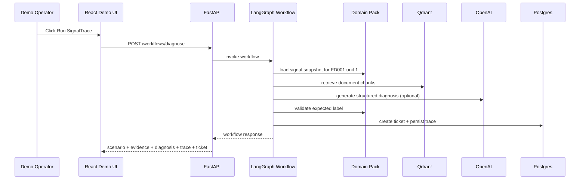
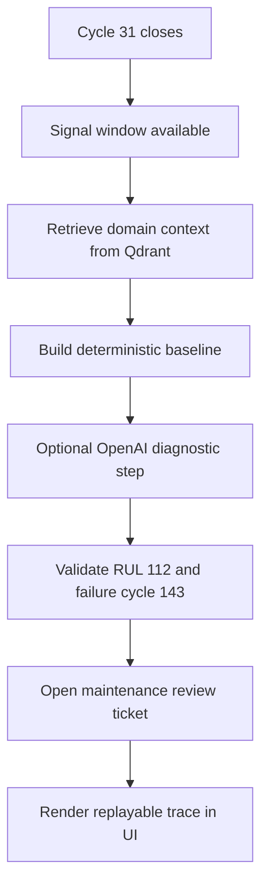

# Demo Architecture

## Demo Goal

The demo is not "ask an AI about NASA."

The demo is a replay of a production-style event:

- an asset closes a telemetry window,
- the health gate is triggered,
- the system reads the latest signal window,
- retrieves the relevant operating context from Qdrant with NASA source
  provenance attached,
- produces a diagnostic decision,
- validates the case,
- opens a maintenance review ticket.

In this repo, the manual trigger is `Run SignalTrace` or `POST /workflows/diagnose`.
In a real deployment, the same workflow would be started by a scheduler, stream processor,
fleet backend, MES bridge, PLC connector, or event bus.

## Demo Scenario

Current replayed situation:

- asset: NASA C-MAPSS `FD001` turbofan test unit `1`,
- trigger point: cycle `31`,
- operating context: one condition, sea level,
- known fault context: high-pressure-compressor degradation,
- decision to produce: keep monitoring or open a maintenance review,
- benchmark label available: RUL `112`, expected failure cycle `143`.

## Demo Sequence

## Demo State Logic

## What The User Should Understand

The demo should communicate five things clearly:

1. this is a replay of a real operational trigger, not a chat toy;
2. the system already has telemetry and documentation before the trigger fires;
3. Qdrant is used to recover the relevant written context at decision time;
4. the LLM is not acting alone, it is grounded by signals and retrieved docs;
5. the output is an operational action with a trace, not just a paragraph of text.

## What The UI Currently Shows

Current visible elements:

- scenario name and trigger,
- physical condition and decision required,
- signal window for cycles `27-31`,
- retrieved evidence panel,
- workflow trace,
- diagnosis text,
- ticket and token usage.

This is enough to explain the demo coherently without inventing subsystems that do not exist yet.

## Why This Demo Works

It is "wow" only if it stays believable.

What makes it credible:

- the telemetry snapshot is concrete,
- the trigger condition is explicit,
- the document retrieval has visible source-backed evidence,
- the benchmark validation is deterministic,
- the AI step is optional and auditable,
- the final output is a traceable maintenance action.

## Evidence Surface

The replay no longer shows generic document excerpts alone. The evidence panel
exposes provenance-aware RAG output from the NASA corpus:

- source label,
- primary source URL,
- related source URLs,
- source authority and normalized source type,
- section title for retrieved excerpt,
- retrieval rank, provider, and score.

That matters because the user can inspect not only what text was retrieved, but
also which canonical NASA or NTRS reference grounded that statement inside the
autonomous health-gate replay.

What would weaken it:

- pretending the system is fully autonomous beyond the current trigger replay,
- pretending LangGraph is already a multi-agent reasoning graph,
- pretending Qdrant stores telemetry rather than documentation,
- adding fake complexity that the code does not actually execute.
